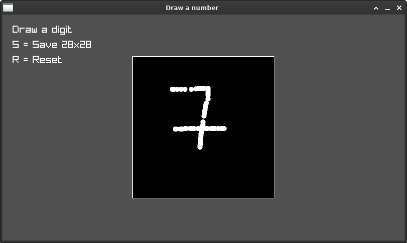

## Develop a neural network that predicts synthesizer parameters from audio samples. The network takes a sound (e.g., an old synth patch) as input and outputs the corresponding synthesizer settings needed to recreate that sound.

## First step: create a basic neural network for handwritten number recognition with PyTorch

Quick Start:

git clone: https://github.com/toxypiks/neuro_synth.git

`cd neuro_synth`<br>
`cd draw_number`<br>
`mkdir build`<br>
`cd build`<br>
`cmake ..`<br>
`make`<br>
`./main`<br>



## test drawn images of numbers
- Idea: draw an image , the check it with python:

### emacs python - work with shell
- load python scipt in Emacs:
  - `C-c C-p` -> loads python shell
  - `C-c C-c` -> loads in script in shell

### training of the neural network
- do learning:
- `train_data_path = "data/mnist_train.csv"`
- `test_data_path = "data/mnist_test.csv"`
```python
organizer = NeuronalNetworkLearningOrganizer(
    train_data_path,
    test_data_path
)
```
- 2x `organizer.train()`

### testing with traindata:
- `(image, target) = organizer.train_dataset[1]`
- ` organizer.classifier.forward(image)`
  - forward propagation of image data -> resilt: one hot vector

### testing with drawn data (see above draw_number)
- `from PIL import Image`
- `image_zahl0 = Image.open("draw_number/screenshots/digit_0.png")`
  - use PIL to load image files
- `from torchvision import transforms`
- `convert_tensor = transforms.ToTensor()`
- `img_tensor0 = convert_tensor(image_zahl0)`
  - use pytorchvision to convert image to tensor
- `img_tensor0_flat = img_tensor0.flatten()`
  - flatten image matrix to a flat vector
- `organizer.classifier.forward(img_tensor0)`
  - result: one hot encoded vector (target)

### Conclusion:
- bad results for european numbers
  - 7 isn't identified properly
- train data consists only of numbers in full window size
  - while drawn numbers in small size are not recognized efficiently

## Idea:
- generate more test data by
  - shrink images
  - roll numbers +/-20° to left or right
- add european number writings
